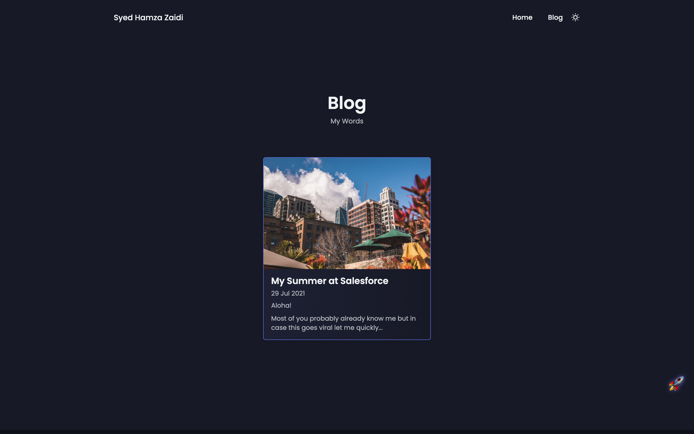
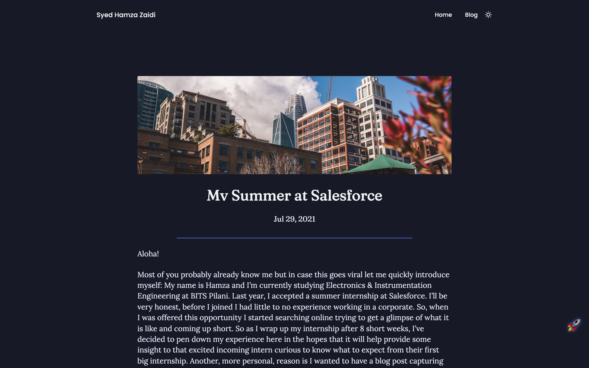

# dev-portfolio

There is a lack of modern developer portfolio templates for Jekyll, so I decided to convert an existing html+css template to a jekyll one so it can be used easily with github-pages.

##### ***Disclaimer:*** Before I go on and take credit for barely doing any work, I would like to give credit to the original creator of the html+css template. Link to their tutorial here: [Responsive Personal Portfolio Website Using HTML CSS And JavaScript | Dark/Light Mode](https://youtu.be/27JtRAI3QO8). I have not been able to contact them and get permission to turn it into a jekyll theme but the tutorial contains all the code and is public so I guess its fine... right? I'll take the repo down in case I'm asked to.

## Theme Preview


## Live Demo

You can check out the live demo at [😎🚀.ws](http://😎🚀.ws) / [syedhamzazaidi.github.io](https://syedhamzazaidi.github.io)


## Installation

I've setup a docker container because I did not want to install ruby on my laptop.

If you're running it for the first time, execute the included `setup.sh` bash script:

```shell
$ ./setup.sh
```

Then spin up the docker container whenever you would like to test out the site locally:

```shell
$ docker start -a jekyll-env
```

... and stop it whenever you aren't using it:

```shell
$ docker stop jekyll-env
```

For testing, launch `localhost:4000` on your browser. The website is updated live with any changes you make, so there's no need to restart the container everytime you make a change to the website. Just refresh the browser and it will update to the latest changes.

Alternatively, if you like to not install anything on your machine, I'd suggest importing your fork into [forestry.io](forestry.io). It won't allow you to edit `_config.yml` and `data/content.yml` files but you can add and edit blog posts through it.

## Contents At-A-Glance

The structing is similar to Jekyll's default theme, 'Minima'. 

The reason I made the jekyll template is to abstract the content from the implementation and for the same reason I'm going to skip over the structure of *_layouts* and *_includes* and get straight to how to add your add to the portfolio. 

First, fork the repo to `<your_github_username>.github.io` to use it with github pages.

There is no need to change anything in the HTML/CSS/JS files to setup your own portfolio. Just make the following changes to `_config.yml` and `_data/content.yml`


### *_config.yml*

```yaml
title: <Title for your website>
author:
  name: <Your name/pseudonym> # This is used in the header and footer
  title: <A label for yourself> # This shows up in the footer
description: > # Description for the website
  <Enter a description for the website \
  can be split over multiple lines.>

google-analytics: <Global google analytics ID> # To track hits

date_format: "%b %-d, %Y" # Idk where this is used... probably blog posts? Either way, ignore

socials: # To generate social links in the footer, there are more options in the actual file
  twitter: athamxa
  github:  syedhamzazaidi
  instagram: hamxa.xaidi
  linkedin: syed-hamza-zaidi

exclude: # Excludes the following files and folders in the build
 - Dockerfile
 - LICENSE.txt
 - README.md
 - README
 - setup.sh
 - Gemfile
 - Gemfile.lock
 - [vendor] # This is necessary if you plan on using forestry.io

plugins: # Idk what these do but I'm scared to remove them at this point
 - jekyll-feed
 - jekyll-seo-tag

```

### *_data/content.yml*

```yaml
# Eh, you'll figure it out. It is self-explanatory.

```

# Blog


Okay, so I've added this entire section myself — so it might be buggy lol. Raise an Issue if anything isn't working and I'll try my best to fix it, or fix it yourself and create a PR.

 If you want to add a blog post, add it under `_posts`. It is formatted exactly the way it is for Minima. File name should be `YYYY-MM-DD-<Title>.md` and the first few lines will look like this:

```yaml
---
layout: post
title: <Title>
thumbnail: <link to file placed in assets/thumbnails>.jpeg, defaults to 'default.jpeg'
---
```



### Customizing templates

Jekyll and Liquid are pretty easy to master, I encourage you to try your hand at it. The [README.md of Minima](https://github.com/jekyll/minima), Jekyll's default theme is a pretty good place to start. Create a PR if you build something cool, I would love to merge it.

### Dark mode

This website supports dark mode but that's done purely through CSS and JS, not through jekyll config.

## Contributing

Bug reports and pull requests are welcome on GitHub at https://github.com/syedhamzazaidi/syedhamzazaidi.github.io (This reads like [Creed's blog address](https://youtu.be/1e5td7-Bpvc) lol). This project is intended to be a safe, welcoming space for collaboration, and contributors are expected to adhere to the [Contributor Covenant](http://contributor-covenant.org) code of conduct.

## License

The theme is available as open source under the terms of the [MIT License](http://opensource.org/licenses/MIT). Can I even put a license on this? Idk

## 🥚

There's a very easy way to change the theme color, try to find it 👀